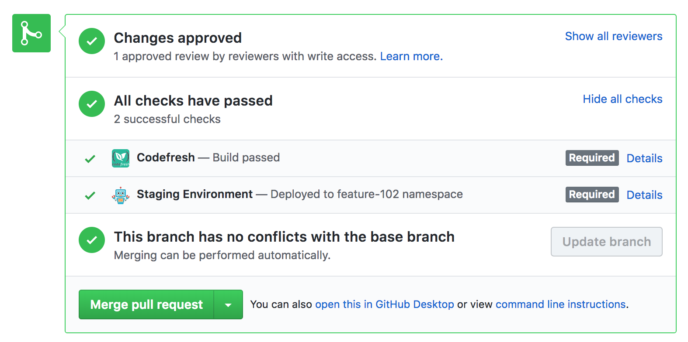
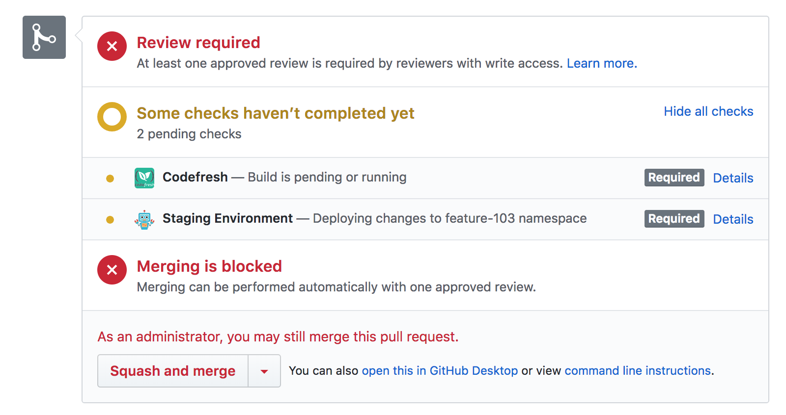

<!-- This file was automatically generated by the `build-harness`. Make all changes to `README.yaml` and run `make readme` to rebuild this file. -->

[](https://cloudposse.com)

# github-status-updater [](https://travis-ci.org/cloudposse/github-status-updater) [](https://github.com/cloudposse/github-status-updater/releases/latest) [](https://slack.cloudposse.com)


Command line utility for updating GitHub commit statuses and enabling required status checks for pull requests.

* https://developer.github.com/v3/repos/statuses
* https://help.github.com/articles/enabling-required-status-checks

Useful for CI environments to set more specific commit and build statuses, including setting the target URL
(the URL of the page representing the build status, or the URL of the deployed application).



###


__NOTE__: Create a [GitHub token](https://help.github.com/articles/creating-an-access-token-for-command-line-use) with `repo:status` and `public_repo` scopes

__NOTE__: The icons in the image above are the avatars of the users for which the GitHub access tokens are issued


---

This project is part of our comprehensive ["SweetOps"](https://docs.cloudposse.com) approach towards DevOps. 


It's 100% Open Source and licensed under the [APACHE2](LICENSE).


## Usage

__NOTE__: The module accepts parameters as command-line arguments or as ENV variables
(or any combination of command-line arguments and ENV vars).
Command-line arguments take precedence over ENV vars.


| Command-line argument |  ENV var            |  Description                                                                   |
|:----------------------|:--------------------|:-------------------------------------------------------------------------------|
| action                | GITHUB_ACTION       | Action to perform: `update_state` or `update_branch_protection`                |
| token                 | GITHUB_TOKEN        | Github access token                                                            |
| owner                 | GITHUB_OWNER        | Github repository owner                                                        |
| repo                  | GITHUB_REPO         | Github repository name                                                         |
| ref                   | GITHUB_REF          | Commit SHA, branch name or tag                                                 |
| state                 | GITHUB_STATE        | Commit state. Possible values are `pending`, `success`, `error` or `failure`   |
| context               | GITHUB_CONTEXT      | Status label. Could be the name of a CI environment (_e.g._ `my-ci`)           |
| description           | GITHUB_DESCRIPTION  | Short high level summary of the status                                         |
| url                   | GITHUB_TARGET_URL   | URL of the page representing the status                                        |


### Build the Go program locally

```sh
go get

CGO_ENABLED=0 go build -v -o "./dist/bin/github-status-updater" *.go
```


### Run locally with ENV vars
[run_locally_with_env_vars.sh](examples/run_locally_with_env_vars.sh)

```sh
export GITHUB_ACTION=update_state
export GITHUB_TOKEN=XXXXXXXXXXXXXXXX
export GITHUB_OWNER=cloudposse
export GITHUB_REPO=github-status-updater
export GITHUB_REF=XXXXXXXXXXXXXXXX
export GITHUB_STATE=success
export GITHUB_CONTEXT="my-ci"
export GITHUB_DESCRIPTION="Commit status with target URL"
export GITHUB_TARGET_URL="https://my-ci.com/build/1"

./dist/bin/github-status-updater
```


After the above command is executed, the commit status will be updated to `success` with the target URL `https://my-ci.com/build/1` (the green check mark in the image below)


###


### Run locally with command-line arguments
[run_locally_with_command_line_args.sh](examples/run_locally_with_command_line_args.sh)

```sh
./dist/bin/github-status-updater \
        -action update_state \
        -token XXXXXXXXXXXXXXXX \
        -owner cloudposse \
        -repo github-status-updater \
        -ref XXXXXXXXXXXXXXX \
        -state success \
        -context "my-ci" \
        -description "Commit status with target URL" \
        -url "https://my-ci.com/build/1"
```


### Build the Docker image
__NOTE__: it will download all `Go` dependencies and then build the program inside the container (see [`Dockerfile`](Dockerfile))


```sh
docker build --tag github-status-updater  --no-cache=true .
```


### Run with Docker

Run the `github-status-updater` in a Docker container with ENV vars
[run_docker_with_env_vars.sh](examples/run_docker_with_env_vars.sh)

```sh
docker run -i --rm \
        -e GITHUB_ACTION=update_state \
        -e GITHUB_TOKEN=XXXXXXXXXXXXXXXX \
        -e GITHUB_OWNER=cloudposse \
        -e GITHUB_REPO=github-status-updater \
        -e GITHUB_REF=XXXXXXXXXXXXXXXX \
        -e GITHUB_STATE=success \
        -e GITHUB_CONTEXT="my-ci" \
        -e GITHUB_DESCRIPTION="Commit status with target URL" \
        -e GITHUB_TARGET_URL="https://my-ci.com/build/1" \
        github-status-updater
```


### Run with Docker

Run the `github-status-updater` in a Docker container with local ENV vars propagated into the container's environment.
[run_docker_with_local_env_vars.sh](examples/run_docker_with_local_env_vars.sh)

```sh
export GITHUB_ACTION=update_state
export GITHUB_TOKEN=XXXXXXXXXXXXXXXX
export GITHUB_OWNER=cloudposse
export GITHUB_REPO=github-status-updater
export GITHUB_REF=XXXXXXXXXXXXXXXX
export GITHUB_STATE=success
export GITHUB_CONTEXT="my-ci"
export GITHUB_DESCRIPTION="Commit status with target URL"
export GITHUB_TARGET_URL="https://my-ci.com/build/1"

docker run -i --rm \
        -e GITHUB_ACTION \
        -e GITHUB_TOKEN \
        -e GITHUB_OWNER \
        -e GITHUB_REPO \
        -e GITHUB_REF \
        -e GITHUB_STATE \
        -e GITHUB_CONTEXT \
        -e GITHUB_DESCRIPTION \
        -e GITHUB_TARGET_URL \
        github-status-updater
```


### Run with Docker

Run the `github-status-updater` in a Docker container with ENV vars declared in a file
[run_docker_with_env_vars_file.sh](examples/run_docker_with_env_vars_file.sh)

```sh
docker run -i --rm --env-file ./example.env github-status-updater
```

## GitHub Required Status Checks


The module can be used to update required status checks for Pull Requests.

This is useful for CI environments to set build statuses with URLs to the build pages.

First, repository administrators need to enforce the branch protection and required status checks before a branch is merged in a pull request or before commits on a local branch can be pushed to the protected remote branch.

* https://help.github.com/articles/enabling-required-status-checks


Then, to add `my-ci` as a status check for branch `test` of the `github-status-updater` repo, execute the `update_branch_protection` action locally

```ssh
./dist/bin/github-status-updater \
        -action update_branch_protection \
        -token XXXXXXXXXXXXXXXXXXXXXX \
        -owner cloudposse \
        -repo github-status-updater \
        -ref test \
        -context my-ci
```


or in a Docker container

```ssh
docker run -i --rm \
        -e GITHUB_ACTION=update_branch_protection \
        -e GITHUB_TOKEN=XXXXXXXXXXXXXXXX \
        -e GITHUB_OWNER=cloudposse \
        -e GITHUB_REPO=github-status-updater \
        -e GITHUB_REF=test \
        -e GITHUB_CONTEXT="my-ci" \
        github-status-updater
```


After the command executes, status check `my-ci` will be enabled for the branch as shown in the image below

###

###


When you create a pull request for the branch, `my-ci` gets a notification from GitHub, starts the build, and updates the build status to `pending`
by executing the following command to update the status of the last commit (`ref XXXXXXXXXXXXXXX`)

```sh
./dist/bin/github-status-updater \
        -action update_state \
        -token XXXXXXXXXXXXXXXX \
        -owner cloudposse \
        -repo github-status-updater \
        -ref XXXXXXXXXXXXXXX \
        -state pending \
        -context "my-ci" \
        -description "still building..." \
        -url "https://my-ci.com/build/1"
```

###

###


In case of any build errors, `my-ci` updates the build status to `error` with the error message in the `description` parameter

```sh
./dist/bin/github-status-updater \
        -action update_state \
        -token XXXXXXXXXXXXXXXX \
        -owner cloudposse \
        -repo github-status-updater \
        -ref XXXXXXXXXXXXXXX \
        -state error \
        -context "my-ci" \
        -description "build error" \
        -url "https://my-ci.com/build/1"
```


###

###


When the build succeeds, `my-ci` updates the build status to `success`

```sh
./dist/bin/github-status-updater \
        -action update_state \
        -token XXXXXXXXXXXXXXXX \
        -owner cloudposse \
        -repo github-status-updater \
        -ref XXXXXXXXXXXXXXX \
        -state success \
        -context "my-ci" \
        -description "build completed" \
        -url "https://my-ci.com/build/1"
```

###

###


###
## Integrating with [CodeFresh](https://codefresh.io) CI/CD Pipelines

`github-status-updater` can be easily integrated into CI/CD pipelines, especially those that use containers for build steps.

[codefresh.yml](examples/codefresh.yml) shows a complete example of a [CodeFresh](https://docs.codefresh.io/docs/introduction-to-codefresh-pipelines) pipeline which performs the following steps:

* Builds a Docker image for the application
* Builds a [Helm](https://github.com/kubernetes/helm) [chart](https://github.com/kubernetes/charts)
* Pushes the Docker images (for commits, branches and tags) to CodeFresh repository
* Executes `update_branch_protection` action on `github-status-updater` [Docker container](https://hub.docker.com/r/cloudposse/github-status-updater) to add `Staging Environment` as a required status check
* Executes `update_state` action on `github-status-updater` [Docker container](https://hub.docker.com/r/cloudposse/github-status-updater) to update `Staging Environment` deployment status to `pending`
* Deploys the Helm chart to a [Kubernetes](https://kubernetes.io) cluster
* Executes `update_state` action on `github-status-updater` [Docker container](https://hub.docker.com/r/cloudposse/github-status-updater) to update `Staging Environment` deployment status to `success`



###


###


## References

For additional context, refer to some of these links. 

- [go-github](https://github.com/google/go-github) - Go library for accessing the GitHub API
- [docs go-github](https://godoc.org/github.com/google/go-github/github) - Package github provides a client for using the GitHub API.
- [enabling-required-status-checks](https://help.github.com/articles/enabling-required-status-checks) - Repository administrators can enforce required status checks before a branch is merged in a pull request or before commits on a local branch can be pushed to the protected remote branch.
- [Statuses API](https://developer.github.com/v3/repos/statuses) - The status API allows external services to mark commits with an error, failure, pending, or success state, which is then reflected in pull requests involving those commits.
- [Building a CI server](https://developer.github.com/v3/guides/building-a-ci-server) - This guide will use that API to demonstrate a setup that you can use.
- [Best practices for writing Dockerfiles](https://docs.docker.com/develop/develop-images/dockerfile_best-practices) - This document covers recommended best practices and methods for building efficient images.
- [Docker build documentation](https://docs.docker.com/engine/reference/commandline/build) - How to build an image from a Dockerfile
- [Docker run documentation](https://docs.docker.com/engine/reference/commandline/run) - How to run a command in a new container
- [Codefresh](https://codefresh.io) - Codefresh is the first continuous delivery platform built for Kubernetes.
- [Introduction to Codefresh pipelines](https://docs.codefresh.io/docs/introduction-to-codefresh-pipelines) - Understand how Codefresh pipelines work
- [Kubernetes Helm](https://github.com/kubernetes/helm) - Helm is a tool for managing Kubernetes charts. Charts are packages of pre-configured Kubernetes resources.
- [Helm Charts](https://github.com/kubernetes/charts) - Use this repository to submit official Charts for Kubernetes Helm.


## Help

**Got a question?**

File a GitHub [issue](https://github.com/cloudposse/github-status-updater/issues), send us an [email][email] or join our [Slack Community][slack].

## Commerical Support

Work directly with our team of DevOps experts via email, slack, and video conferencing. 

We provide *commercial support* for all of our [Open Source][github] projects. As a *Dedicated Support* customer, you have access to our team of subject matter experts at a fraction of the cost of a fulltime engineer. 

[](mailto:hello@cloudposse.com)

- **Questions.** We'll use a Shared Slack channel between your team and ours.
- **Troubleshooting.** We'll help you triage why things aren't working.
- **Code Reviews.** We'll review your Pull Requests and provide constructive feedback.
- **Bug Fixes.** We'll rapidly work to fix any bugs in our projects.
- **Build New Terraform Modules.** We'll develop original modules to provision infrastructure.
- **Cloud Architecture.** We'll assist with your cloud strategy and design.
- **Implementation.** We'll provide hands on support to implement our reference architectures. 


## Community Forum

Get access to our [Open Source Community Forum][slack] on Slack. It's **FREE** to join for everyone! Our "SweetOps" community is where you get to talk with others who share a similar vision for how to rollout and manage infrastructure. This is the best place to talk shop, ask questions, solicit feedback, and work together as a community to build *sweet* infrastructure.

## Contributing

### Bug Reports & Feature Requests

Please use the [issue tracker](https://github.com/cloudposse/github-status-updater/issues) to report any bugs or file feature requests.

### Developing

If you are interested in being a contributor and want to get involved in developing this project or [help out](https://github.com/orgs/cloudposse/projects/3) with our other projects, we would love to hear from you! Shoot us an [email](mailto:hello@cloudposse.com).

In general, PRs are welcome. We follow the typical "fork-and-pull" Git workflow.

 1. **Fork** the repo on GitHub
 2. **Clone** the project to your own machine
 3. **Commit** changes to your own branch
 4. **Push** your work back up to your fork
 5. Submit a **Pull Request** so that we can review your changes

**NOTE:** Be sure to merge the latest changes from "upstream" before making a pull request!


## Copyright

Copyright © 2017-2018 [Cloud Posse, LLC](https://cloudposse.com)


## License 

[](https://opensource.org/licenses/Apache-2.0) 

See [LICENSE](LICENSE) for full details.

    Licensed to the Apache Software Foundation (ASF) under one
    or more contributor license agreements.  See the NOTICE file
    distributed with this work for additional information
    regarding copyright ownership.  The ASF licenses this file
    to you under the Apache License, Version 2.0 (the
    "License"); you may not use this file except in compliance
    with the License.  You may obtain a copy of the License at

      https://www.apache.org/licenses/LICENSE-2.0

    Unless required by applicable law or agreed to in writing,
    software distributed under the License is distributed on an
    "AS IS" BASIS, WITHOUT WARRANTIES OR CONDITIONS OF ANY
    KIND, either express or implied.  See the License for the
    specific language governing permissions and limitations
    under the License.


## Trademarks

All other trademarks referenced herein are the property of their respective owners.

## About

This project is maintained and funded by [Cloud Posse, LLC][website]. Like it? Please let us know at <hello@cloudposse.com>

[](https://cloudposse.com)

We're a [DevOps Professional Services][hire] company based in Los Angeles, CA. We love [Open Source Software](https://github.com/cloudposse/)!

We offer paid support on all of our projects.  

Check out [our other projects][github], [apply for a job][jobs], or [hire us][hire] to help with your cloud strategy and implementation.

  [docs]: https://docs.cloudposse.com/
  [website]: https://cloudposse.com/
  [github]: https://github.com/cloudposse/
  [jobs]: https://cloudposse.com/jobs/
  [hire]: https://cloudposse.com/contact/
  [slack]: https://slack.cloudposse.com/
  [linkedin]: https://www.linkedin.com/company/cloudposse
  [twitter]: https://twitter.com/cloudposse/
  [email]: mailto:hello@cloudposse.com


### Contributors

|  [![Andriy Knysh][aknysh_avatar]][aknysh_homepage]<br/>[Andriy Knysh][aknysh_homepage] |
|---|

  [aknysh_homepage]: https://github.com/aknysh
  [aknysh_avatar]: https://github.com/aknysh.png?size=150


