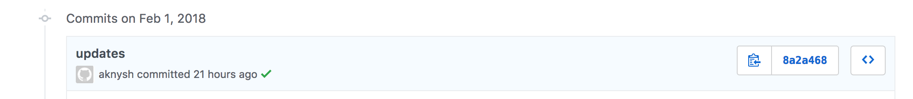

# github-commit-status [](https://travis-ci.org/cloudposse/github-commit-status)


Command line utility for setting or updating GitHub commit status.




Useful for CI environments like Travis, Circle or CodeFresh to set more specific commit statuses, including setting the target URL (the URL of the page representing the status).

It accepts parameters as command-line arguments or as ENV variables.


__NOTE__: Create a [GitHub token](https://help.github.com/articles/creating-an-access-token-for-command-line-use/) with `repo:status` scope


__NOTE__: `-state` or `GITHUB_COMMIT_STATE` must be one of `error`, `failure`, `pending`, `success`


## Usage


### Build Go program locally

```sh
go get

CGO_ENABLED=0 go build -v -o "./dist/bin/github-commit-status" *.go
```


### Run locally with ENV vars

```sh
export GITHUB_TOKEN=XXXXXXXXXXXXXXXX
export GITHUB_OWNER=cloudposse
export GITHUB_REPO=github-commit-status
export GITHUB_COMMIT_SHA=XXXXXXXXXXXXXXXX
export GITHUB_COMMIT_STATE=success
export GITHUB_COMMIT_CONTEXT=CI
export GITHUB_COMMIT_DESCRIPTION="Commit status with target URL"
export GITHUB_COMMIT_TARGET_URL=https://my.buildstatus.com/build/3

./dist/bin/github-commit-status
```


### Run locally with command-line arguments

```sh
./dist/bin/github-commit-status \
            -token XXXXXXXXXXXXXXXX \
            -owner cloudposse \
            -repo github-commit-status \
            -sha XXXXXXXXXXXXXXX \
            -state success \
            -context CI \
            -description "Commit status with target URL" \
            -url https://my.buildstatus.com/build/3
```


### Build Docker container
__NOTE__: it will download all `Go` dependencies and then build the program inside the container (see [`Dockerfile`](Dockerfile))


```sh
docker build --tag github-commit-status  --no-cache=true .
```


### Run in Docker container with ENV vars

```sh
docker run -it --rm \
            -e GITHUB_TOKEN=XXXXXXXXXXXXXXXX \
            -e GITHUB_OWNER=cloudposse \
            -e GITHUB_REPO=github-commit-status \
            -e GITHUB_COMMIT_SHA=XXXXXXXXXXXXXXXX \
            -e GITHUB_COMMIT_STATE=success \
            -e GITHUB_COMMIT_CONTEXT=CI \
            -e GITHUB_COMMIT_DESCRIPTION="Commit status with target URL" \
            -e GITHUB_COMMIT_TARGET_URL=https://my.buildstatus.com/build/3 \
            github-commit-status
```


### Run in Docker container with local ENV vars propagated into the container's environment

```sh
export GITHUB_TOKEN=XXXXXXXXXXXXXXXX
export GITHUB_OWNER=cloudposse
export GITHUB_REPO=github-commit-status
export GITHUB_COMMIT_SHA=XXXXXXXXXXXXXXXX
export GITHUB_COMMIT_STATE=success
export GITHUB_COMMIT_CONTEXT=CI
export GITHUB_COMMIT_DESCRIPTION="Commit status with target URL"
export GITHUB_COMMIT_TARGET_URL=https://my.buildstatus.com/build/3

docker run -it --rm \
            -e GITHUB_TOKEN \
            -e GITHUB_OWNER \
            -e GITHUB_REPO \
            -e GITHUB_COMMIT_SHA \
            -e GITHUB_COMMIT_STATE \
            -e GITHUB_COMMIT_CONTEXT \
            -e GITHUB_COMMIT_DESCRIPTION \
            -e GITHUB_COMMIT_TARGET_URL \
            github-commit-status
```


### Run in Docker container with ENV vars declared in a file

```sh
docker run -it --rm --env-file ./env.list github-commit-status
```


## References
* https://github.com/google/go-github
* https://docs.docker.com/develop/develop-images/dockerfile_best-practices
* https://docs.docker.com/engine/reference/commandline/build
* https://docs.docker.com/engine/reference/commandline/run/


## Help

**Got a question?**

File a GitHub [issue](https://github.com/cloudposse/github-commit-status/issues), send us an [email](mailto:hello@cloudposse.com) or reach out to us on [Gitter](https://gitter.im/cloudposse/).


## Contributing

### Bug Reports & Feature Requests

Please use the [issue tracker](https://github.com/cloudposse/github-commit-status/issues) to report any bugs or file feature requests.

### Developing

If you are interested in being a contributor and want to get involved in developing `github-commit-status`, we would love to hear from you! Shoot us an [email](mailto:hello@cloudposse.com).

In general, PRs are welcome. We follow the typical "fork-and-pull" Git workflow.

 1. **Fork** the repo on GitHub
 2. **Clone** the project to your own machine
 3. **Commit** changes to your own branch
 4. **Push** your work back up to your fork
 5. Submit a **Pull request** so that we can review your changes

**NOTE:** Be sure to merge the latest from "upstream" before making a pull request!


## License

[APACHE 2.0](LICENSE) © 2018 [Cloud Posse, LLC](https://cloudposse.com)

See [LICENSE](LICENSE) for full details.

    Licensed to the Apache Software Foundation (ASF) under one
    or more contributor license agreements.  See the NOTICE file
    distributed with this work for additional information
    regarding copyright ownership.  The ASF licenses this file
    to you under the Apache License, Version 2.0 (the
    "License"); you may not use this file except in compliance
    with the License.  You may obtain a copy of the License at

      http://www.apache.org/licenses/LICENSE-2.0

    Unless required by applicable law or agreed to in writing,
    software distributed under the License is distributed on an
    "AS IS" BASIS, WITHOUT WARRANTIES OR CONDITIONS OF ANY
    KIND, either express or implied.  See the License for the
    specific language governing permissions and limitations
    under the License.


## About

`github-commit-status` is maintained and funded by [Cloud Posse, LLC][website].

Like it? Please let us know at <hello@cloudposse.com>

We love [Open Source Software](https://github.com/cloudposse/)!

See [our other projects][community]
or [hire us][hire] to help build your next cloud platform.

  [website]: https://cloudposse.com/
  [community]: https://github.com/cloudposse/
  [hire]: https://cloudposse.com/contact/


### Contributors

| [![Erik Osterman][erik_img]][erik_web]<br/>[Erik Osterman][erik_web] | [![Andriy Knysh][andriy_img]][andriy_web]<br/>[Andriy Knysh][andriy_web] |
|-------------------------------------------------------|------------------------------------------------------------------|

  [erik_img]: http://s.gravatar.com/avatar/88c480d4f73b813904e00a5695a454cb?s=144
  [erik_web]: https://github.com/osterman/
  [andriy_img]: https://avatars0.githubusercontent.com/u/7356997?v=4&u=ed9ce1c9151d552d985bdf5546772e14ef7ab617&s=144
  [andriy_web]: https://github.com/aknysh/
