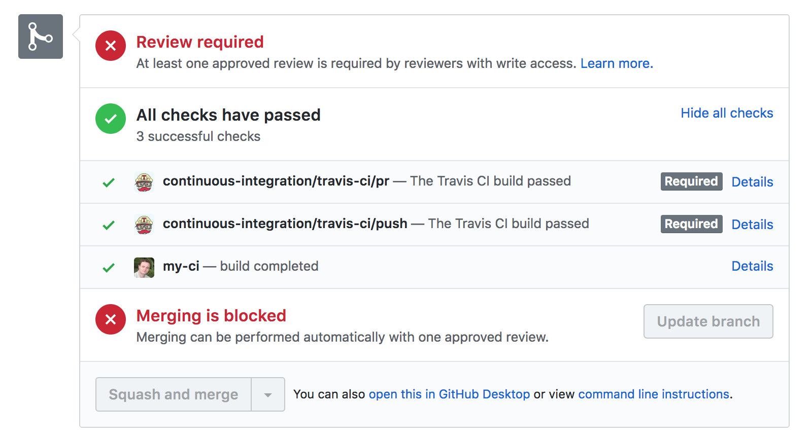
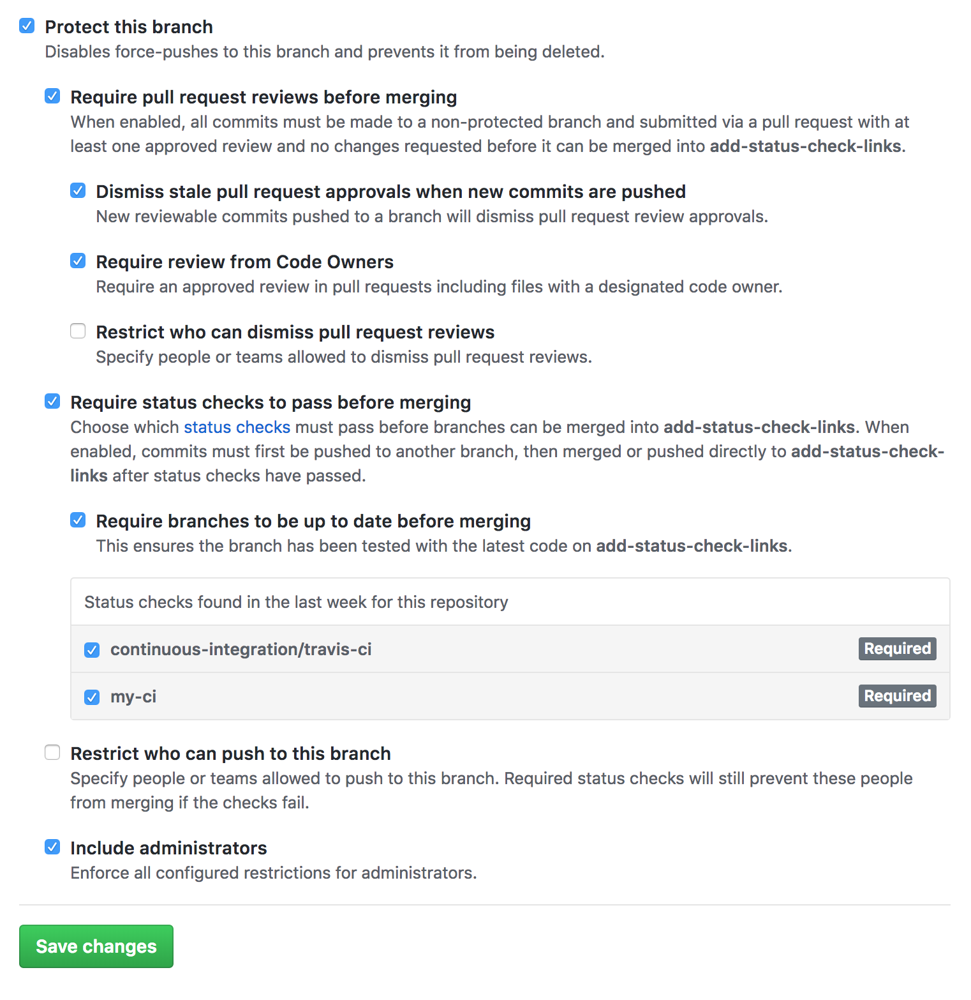
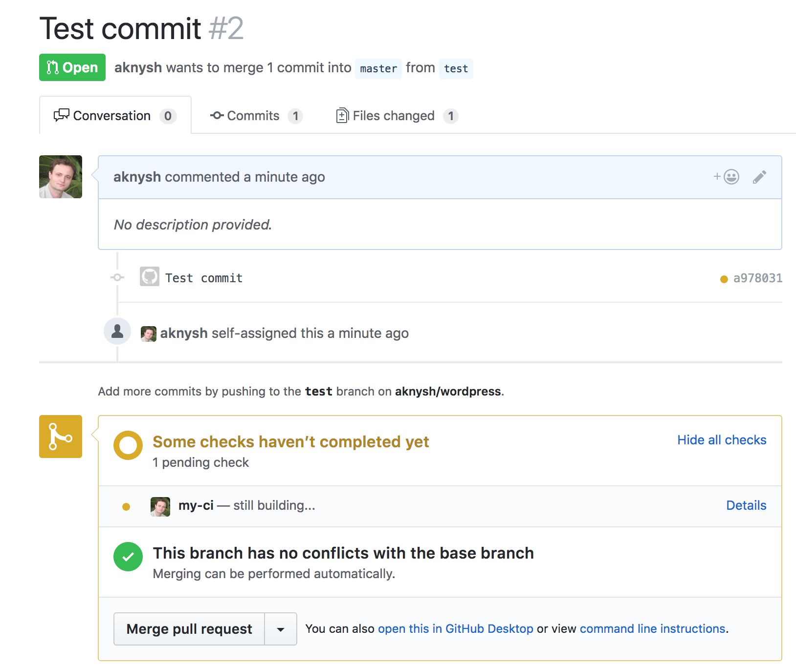

# github-status-updater [](https://travis-ci.org/cloudposse/github-status-updater)


Command line utility for updating GitHub commit statuses and enabling required status checks for pull requests.

* https://developer.github.com/v3/repos/statuses
* https://help.github.com/articles/enabling-required-status-checks



###


Useful for CI environments to set more specific commit and build statuses, including setting the target URL (the URL of the page representing the status).

__NOTE__: Create a [GitHub token](https://help.github.com/articles/creating-an-access-token-for-command-line-use/) with `repo:status` and `public_repo` scopes

__NOTE__: The icons in the image above are the avatars of the users for which the GitHub access tokens are issued


## Usage

__NOTE__: The module accepts parameters as command-line arguments or as ENV variables (or any combination of command-line arguments and ENV vars)


| Command-line argument |  ENV var            |  Description                                                                   |
|:----------------------|:--------------------|:-------------------------------------------------------------------------------|
| action                | GITHUB_ACTION       | Action to perform: `update_state` or `update_branch_protection`                |
| token                 | GITHUB_TOKEN        | Github access token                                                            |
| owner                 | GITHUB_OWNER        | Github repository owner                                                        |
| repo                  | GITHUB_REPO         | Github repository name                                                         |
| ref                   | GITHUB_REF          | Commit SHA, branch name or tag                                                 |
| state                 | GITHUB_STATE        | Commit state. Possible values are `pending`, `success`, `error` or `failure`   |
| context               | GITHUB_CONTEXT      | Status label. Could be the name of a CI environment (_e.g._ `my-ci`)           |
| description           | GITHUB_DESCRIPTION  | Short high level summary of the status                                         |
| url                   | GITHUB_TARGET_URL   | URL of the page representing the status                                        |


### build the Go program locally

```sh
go get

CGO_ENABLED=0 go build -v -o "./dist/bin/github-status-updater" *.go
```


### run locally with ENV vars
[run_locally_with_env_vars.sh](examples/run_locally_with_env_vars.sh)

```sh
export GITHUB_ACTION=update_state
export GITHUB_TOKEN=XXXXXXXXXXXXXXXX
export GITHUB_OWNER=cloudposse
export GITHUB_REPO=github-status-updater
export GITHUB_REF=XXXXXXXXXXXXXXXX
export GITHUB_STATE=success
export GITHUB_CONTEXT="my-ci"
export GITHUB_DESCRIPTION="Commit status with target URL"
export GITHUB_TARGET_URL="https://my-ci.com/build/1"

./dist/bin/github-status-updater
```


After the above command is executed, the commit status will be updated to `success` with the target URL `https://my-ci.com/build/1` (the green check mark in the image below)


###


### run locally with command-line arguments
[run_locally_with_command_line_args.sh](examples/run_locally_with_command_line_args.sh)

```sh
./dist/bin/github-status-updater \
        -action update_state \
        -token XXXXXXXXXXXXXXXX \
        -owner cloudposse \
        -repo github-status-updater \
        -ref XXXXXXXXXXXXXXX \
        -state success \
        -context "my-ci" \
        -description "Commit status with target URL" \
        -url "https://my-ci.com/build/1"
```


### build the Docker image
__NOTE__: it will download all `Go` dependencies and then build the program inside the container (see [`Dockerfile`](Dockerfile))


```sh
docker build --tag github-status-updater  --no-cache=true .
```


### run in a Docker container with ENV vars
[run_docker_with_env_vars.sh](examples/run_docker_with_env_vars.sh)

```sh
docker run -i --rm \
        -e GITHUB_ACTION=update_state \
        -e GITHUB_TOKEN=XXXXXXXXXXXXXXXX \
        -e GITHUB_OWNER=cloudposse \
        -e GITHUB_REPO=github-status-updater \
        -e GITHUB_REF=XXXXXXXXXXXXXXXX \
        -e GITHUB_STATE=success \
        -e GITHUB_CONTEXT="my-ci" \
        -e GITHUB_DESCRIPTION="Commit status with target URL" \
        -e GITHUB_TARGET_URL="https://my-ci.com/build/1" \
        github-status-updater
```


### run in a Docker container with local ENV vars propagated into the container's environment
[run_docker_with_local_env_vars.sh](examples/run_docker_with_local_env_vars.sh)

```sh
export GITHUB_ACTION=update_state
export GITHUB_TOKEN=XXXXXXXXXXXXXXXX
export GITHUB_OWNER=cloudposse
export GITHUB_REPO=github-status-updater
export GITHUB_REF=XXXXXXXXXXXXXXXX
export GITHUB_STATE=success
export GITHUB_CONTEXT="my-ci"
export GITHUB_DESCRIPTION="Commit status with target URL"
export GITHUB_TARGET_URL="https://my-ci.com/build/1"

docker run -i --rm \
        -e GITHUB_ACTION \
        -e GITHUB_TOKEN \
        -e GITHUB_OWNER \
        -e GITHUB_REPO \
        -e GITHUB_REF \
        -e GITHUB_STATE \
        -e GITHUB_CONTEXT \
        -e GITHUB_DESCRIPTION \
        -e GITHUB_TARGET_URL \
        github-status-updater
```


### run in a Docker container with ENV vars declared in a file
[run_docker_with_env_vars_file.sh](examples/run_docker_with_env_vars_file.sh)

```sh
docker run -i --rm --env-file ./example.env github-status-updater
```


##
## GitHub Required Status Checks


The module can be used to update required status checks for Pull Requests.

This is useful for CI environments to set build statuses with URLs to the build pages.

First, repository administrators need to enforce the branch protection and required status checks before a branch is merged in a pull request or before commits on a local branch can be pushed to the protected remote branch.

* https://help.github.com/articles/enabling-required-status-checks





Then, to add `my-ci` as a status check for branch `test` of the `github-status-updater` repo, execute the `update_branch_protection` action locally

```ssh
./dist/bin/github-status-updater \
        -action update_branch_protection \
        -token XXXXXXXXXXXXXXXXXXXXXX \
        -owner cloudposse \
        -repo github-status-updater \
        -ref test \
        -context my-ci
```


or in a Docker container

```ssh
docker run -i --rm \
        -e GITHUB_ACTION=update_branch_protection \
        -e GITHUB_TOKEN=XXXXXXXXXXXXXXXX \
        -e GITHUB_OWNER=cloudposse \
        -e GITHUB_REPO=github-status-updater \
        -e GITHUB_REF=test \
        -e GITHUB_CONTEXT="my-ci" \
        github-status-updater
```


After the command executes, status check `my-ci` will be enabled for the branch as shown in the image below

###

###


When you create a pull request for the branch, `my-ci` gets a notification from GitHub, starts the build, and updates the build status to `pending`
by executing the following command to update the status of the last commit (`ref XXXXXXXXXXXXXXX`)

```sh
./dist/bin/github-status-updater \
        -action update_state \
        -token XXXXXXXXXXXXXXXX \
        -owner cloudposse \
        -repo github-status-updater \
        -ref XXXXXXXXXXXXXXX \
        -state pending \
        -context "my-ci" \
        -description "still building..." \
        -url "https://my-ci.com/build/1"
```

###

###


In case of any build errors, `my-ci` updates the build status to `error` with the error message in the `description` parameter

```sh
./dist/bin/github-status-updater \
        -action update_state \
        -token XXXXXXXXXXXXXXXX \
        -owner cloudposse \
        -repo github-status-updater \
        -ref XXXXXXXXXXXXXXX \
        -state error \
        -context "my-ci" \
        -description "build error" \
        -url "https://my-ci.com/build/1"
```


###

###


When the build succeeds, `my-ci` updates the build status to `success`

```sh
./dist/bin/github-status-updater \
        -action update_state \
        -token XXXXXXXXXXXXXXXX \
        -owner cloudposse \
        -repo github-status-updater \
        -ref XXXXXXXXXXXXXXX \
        -state success \
        -context "my-ci" \
        -description "build completed" \
        -url "https://my-ci.com/build/1"
```

###

###


## References
* https://github.com/google/go-github
* https://godoc.org/github.com/google/go-github/github
* https://help.github.com/articles/enabling-required-status-checks
* https://developer.github.com/v3/repos/statuses
* https://developer.github.com/v3/guides/building-a-ci-server
* https://docs.docker.com/develop/develop-images/dockerfile_best-practices
* https://docs.docker.com/engine/reference/commandline/build
* https://docs.docker.com/engine/reference/commandline/run


## Help

**Got a question?**

File a GitHub [issue](https://github.com/cloudposse/github-status-updater/issues), send us an [email](mailto:hello@cloudposse.com) or reach out to us on [Gitter](https://gitter.im/cloudposse/).


## Contributing

### Bug Reports & Feature Requests

Please use the [issue tracker](https://github.com/cloudposse/github-status-updater/issues) to report any bugs or file feature requests.

### Developing

If you are interested in being a contributor and want to get involved in developing `github-status-updater`, we would love to hear from you! Shoot us an [email](mailto:hello@cloudposse.com).

In general, PRs are welcome. We follow the typical "fork-and-pull" Git workflow.

 1. **Fork** the repo on GitHub
 2. **Clone** the project to your own machine
 3. **Commit** changes to your own branch
 4. **Push** your work back up to your fork
 5. Submit a **Pull request** so that we can review your changes

**NOTE:** Be sure to merge the latest from "upstream" before making a pull request!


## License

[APACHE 2.0](LICENSE) © 2018 [Cloud Posse, LLC](https://cloudposse.com)

See [LICENSE](LICENSE) for full details.

    Licensed to the Apache Software Foundation (ASF) under one
    or more contributor license agreements.  See the NOTICE file
    distributed with this work for additional information
    regarding copyright ownership.  The ASF licenses this file
    to you under the Apache License, Version 2.0 (the
    "License"); you may not use this file except in compliance
    with the License.  You may obtain a copy of the License at

      http://www.apache.org/licenses/LICENSE-2.0

    Unless required by applicable law or agreed to in writing,
    software distributed under the License is distributed on an
    "AS IS" BASIS, WITHOUT WARRANTIES OR CONDITIONS OF ANY
    KIND, either express or implied.  See the License for the
    specific language governing permissions and limitations
    under the License.


## About

`github-status-updater` is maintained and funded by [Cloud Posse, LLC][website].


Like it? Please let us know at <hello@cloudposse.com>

We love [Open Source Software](https://github.com/cloudposse/)!

See [our other projects][community]
or [hire us][hire] to help build your next cloud platform.

  [website]: https://cloudposse.com/
  [community]: https://github.com/cloudposse/
  [hire]: https://cloudposse.com/contact/


### Contributors

| [![Erik Osterman][erik_img]][erik_web]<br/>[Erik Osterman][erik_web] | [![Andriy Knysh][andriy_img]][andriy_web]<br/>[Andriy Knysh][andriy_web] |
|-------------------------------------------------------|------------------------------------------------------------------|

  [erik_img]: http://s.gravatar.com/avatar/88c480d4f73b813904e00a5695a454cb?s=144
  [erik_web]: https://github.com/osterman/
  [andriy_img]: https://avatars0.githubusercontent.com/u/7356997?v=4&u=ed9ce1c9151d552d985bdf5546772e14ef7ab617&s=144
  [andriy_web]: https://github.com/aknysh/
